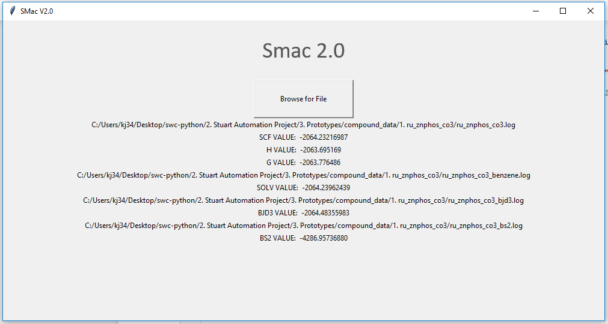

# SMac-GUI

A Program for Extracting Variables from Gaussian Files.

Computational Chemists typically extract values from Gaussian files to perform calculations.

This program allows a user to navigate to a file and, depending on the file name, extract key energy values (enthalpy, free energy etc.)

